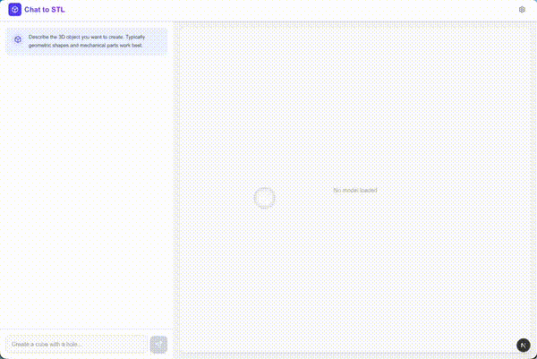

# Overhang

[](https://github.com/flowful-ai/overhang/actions/workflows/test.yml)
[](LICENSE)

**Enclosures and brackets, designed by chat.**

Describe the part you need and get a print-ready STL or 3MF in under a minute. Free and source-available, built by [Flowful.ai](https://flowful.ai). No account, no paywall.



```
You: Enclosure for a Pi 5, USB-C cutout, 3mm wall
AI: [generates 3D model: 92 x 65 x 28 mm, M2.5 bosses]

You: Add a 40mm fan slot on the lid
AI: [updates model]

You: Export 3MF for Bambu
[Download STL / 3MF -> Print]
```

**Stack:** Next.js 16 · React 19 · Vercel AI SDK (agentic tool loop) · assistant-ui · React Three Fiber · Monaco · Tailwind v4 · FastAPI · CadQuery · OpenRouter

---

## What it does

- **Conversational CAD** — describe parts in plain English; refine by chat.
- **Agentic self-correction** — the LLM holds a `runCadquery` tool, sees the render result + design-review warnings, and fixes its own mistakes (up to 5 steps per turn).
- **Vision** — snapshot the viewer, point, ask for changes.
- **Live 3D preview**: bounded 256×256 mm build plate (Bambu default), XYZ gizmo, wireframe, dimensions. Keys: `R` or `F` reset camera · `W` wireframe · `G` grid (ignored when typing).
- **Code access** — the generated CadQuery Python is visible in Monaco; edit and re-render.
- **Automated print review** — watertight, overhang, and thin-wall checks surfaced before download.
- **Export** — STL or 3MF; Save-for-Slicer via File System Access API.
- **Multi-model**: GPT-5.6 Luna (default), Claude Sonnet 5, Gemini 3 Flash (best eval pass rate), DeepSeek V4 Flash (cheapest, ~$0.002 per design). The last three were picked by eval (`docs/evals/`); Luna has not been evaluated yet.

## Quick Start

You need Docker and an OpenRouter API key (free to create) at [openrouter.ai/keys](https://openrouter.ai/keys).

```bash
git clone https://github.com/flowful-ai/overhang && cd overhang && ./setup.sh
```

`setup.sh` writes `.env` for you: it asks for your OpenRouter key (the only value it can't generate), creates the `WORKER_SECRET` that Docker Compose needs, then starts everything. Open **http://localhost:3000**. The app runs free with no sign-in.

## Models

Overhang talks to OpenRouter only, so `OPENROUTER_API_KEY` is the one LLM credential. The model list lives in `MODELS` in `src/lib/utils.ts`; the first entry is the app default. The eval runner has its own default (`DEFAULT_MODEL` in `evals/run.ts`, currently the cheapest model), so eval numbers are not the app default unless you pass `--model`.

## How It Works

The LLM is an agent: it holds a `runCadquery` tool, decides when to call it, when to fix, and when to stop. The Python worker is just a tool the agent invokes.

```
+----------+    prompt     +-------------+   tool: runCadquery(code)   +-------------+
|   You    | ------------> |     LLM     | --------------------------> |  CadQuery   |
|          |               |  (agentic)  |                             |   worker    |
|          | <------------ |             | <-------------------------- |  (sandbox)  |
+----------+    stream     +-------------+   {success, warnings, stl}  +-------------+
                                  |
                                  | loop: fix on error,
                                  | optionally fix on warning,
                                  | stop on success (or after 5 steps)
                                  v
                            tool call again
```

The loop is capped at 5 steps per turn so a confused model can't burn tokens indefinitely; tools are disabled on the last step, so a turn always ends with a text reply. A clean turn takes 2 steps (render, then reply); each fix adds one. Every generated model is automatically validated for printability — warnings go to both the LLM (so it can fix them) and to you as a dedicated card in the chat.

## Example Prompts

| Goal | Prompt |
|------|--------|
| Enclosure | "Box for a Pi 5, USB-C cutout, 3mm wall" |
| Bracket | "L-bracket, 60×40mm, 3 holes for M3 screws" |
| Adapter | "GoPro 1/4-20 tripod adapter" |
| Mechanical | "Spur gear, module 1.5, 20 teeth, 5mm bore" |
| Cable management | "Cable clip for a 6mm bundle" |
| Use vision | [Snapshot] "Add a notch where I'm pointing" |

Start simple and iterate ("cube" → "add hole" → "fillet edges"), include units and dimensions, and mention material (PLA / PETG / TPU / ABS) for adjusted tolerances.

## Architecture

- **Next.js app** (`src/`): chat UI, 3D viewer, code editor and the API routes. `generate-cad` runs the agent loop, `render-cad` and `export-3mf` call the worker, and `health` covers monitoring.
- **CAD worker** (`cad-worker/`): FastAPI and CadQuery. Runs the generated script in a restricted sandbox inside its container, checks the mesh, and exports STL and 3MF. The app talks to it over JSON (`src/lib/cad-worker-protocol.ts`).
- **No database, no accounts**: chats stay in the browser's localStorage.

## Environment Variables

| Variable | Required | Default | Description |
|----------|----------|---------|-------------|
| `OPENROUTER_API_KEY` | Yes | - | [Get one here](https://openrouter.ai/keys) |
| `CAD_WORKER_URL` | No | `http://localhost:8000` | Python worker URL |
| `ALLOWED_ORIGINS` | No | `http://frontend:3000` | CORS allowlist for the worker (code fallback when unset is `*`) |
| `WORKER_SECRET` | Yes (Compose) | unset | Shared secret between the frontend and the CAD worker, so nothing else on the Docker network can drive arbitrary Python execution. `docker-compose.yml` refuses to start without it; `setup.sh` generates it. Set the SAME value on both services. Generate with `openssl rand -hex 32`. |
| `EXEC_TIMEOUT` | No | `30` | Max CAD execution time (sec) |
| `CAD_MAX_CONCURRENT_RENDERS` | No | `4` | Max simultaneous renders in the worker; over this it sheds load with 503 |
| `TRUST_PROXY` | No | `0` (`.env.example`), `1` (compose without `.env` value) | Number of trusted proxies that append to `X-Forwarded-For`; the rate limiter keys on the entry that many hops from the right. `0` for local installs (all callers share one bucket), `1` behind one reverse proxy, `2` behind a CDN plus a reverse proxy. |
| `TRUST_CF_CONNECTING_IP` | No | unset | `1` keys the rate limiter on `CF-Connecting-IP`. Forgeable by anyone who reaches the origin without Cloudflare: enable only with the origin firewalled to Cloudflare IP ranges or Authenticated Origin Pulls. |
| `FRONTEND_BIND` | No | `127.0.0.1` | Host interface compose publishes port 3000 on. Keeps other machines off port 3000; it does not firewall your proxy. |
| `MAX_CONCURRENT_GENERATIONS` | No | `4` | Max simultaneous `/api/generate-cad` turns, shared by all callers. Over it: 503. Falls back to the older `ANON_MAX_CONCURRENT_GENERATIONS`. |
| `MAX_CONCURRENT_RENDERS` | No | `4` | Same, for `/api/render-cad` and `/api/export-3mf` calls (one shared pool). Falls back to `ANON_MAX_CONCURRENT_RENDERS`. |
| `EMERGENCY_DISABLE_GENERATION` | No | unset | Set to `1` to force `/api/generate-cad` to return 503. Kill switch for cost incidents. |
| `WEB_SEARCH` | No | on | Lets the agent look up product specs through OpenRouter web search, on the first step of a turn only. The model decides how many queries that step runs, and each is billed by the provider (about $0.01 per query on GPT-5.6 Luna). Enabled per model in `MODELS` (`src/lib/utils.ts`), currently GPT-5.6 Luna only. Only unset, empty, `on`, `1` or `true` enable it; any other value disables it for everyone. Users can also turn it off in Settings. |
| `LOG_LEVEL` | No | `INFO` | CAD worker log level. |

## Security

- **No accounts**: the app has no sign-in. Anyone who can reach it can generate designs on your OpenRouter key. `FRONTEND_BIND` keeps it on loopback by default; add access control in your proxy before exposing it to others.
- **Python sandbox (defence in depth)**: the worker runs LLM-generated Python with `exec()` and a restricted `__builtins__` dict (`exec`, `eval`, `open`, `compile`, `getattr`, `setattr`, `type`, `object` removed), an `__import__` allowlist (`math`, `cadquery`, `numpy`, `itertools`, `functools`, `collections`), and parse-time rejection of dunder access. This raises the bar but is not a security boundary: assume it can be bypassed.
- **Container isolation (the real boundary)**: the CAD worker container runs non-root with all capabilities dropped, a read-only root filesystem, `no-new-privileges`, CPU and memory limits, and no port published to the host.
- **Worker network egress is open**: `app-network` is a normal bridge network, so the worker container can open outbound connections to the internet and to anything the host can route to. If you want egress blocked, add host firewall or egress rules for the worker container (for example in the `DOCKER-USER` iptables chain).
- **Worker auth** — `/render` and `/export-3mf` require a matching `X-Worker-Secret` header (`WORKER_SECRET`), blocking curl-from-inside-the-network that CORS can't stop.
- **Rate limiting** — Per-IP limits: `/api/generate-cad` 10/min, `/api/render-cad` and `/api/export-3mf` 20/min. Client IP comes from proxy headers only when `TRUST_PROXY` or `TRUST_CF_CONNECTING_IP` is set, never from the client-controlled left end of `X-Forwarded-For`. IPv6 clients are keyed by /64.
- **Concurrency**: all callers share a global pool per endpoint (`MAX_CONCURRENT_GENERATIONS`, `MAX_CONCURRENT_RENDERS`); over the cap the route returns 503.
- **Kill switch** — `EMERGENCY_DISABLE_GENERATION=1` returns 503 instantly.
- **Cost cap** — Hard `maxOutputTokens` per turn caps a single LLM reply from running away.
- **Input validation** — Server-side: AI SDK UI message validation, user/assistant roles only, 10,000-character prompts, inline images only (2 MB for the image being sent; unusable images in older turns are dropped with a placeholder), code length, model allowlist, conversation history cap (200 messages), and a request body cap (10 MB) counted as the body streams, so chunked uploads can't skip it.
- **HTTP headers** — CSP, HSTS, X-Frame-Options, nosniff, Referrer-Policy, Permissions-Policy (see `next.config.ts`).
- **Sanitized errors** — paths stripped from error text before reaching the user or the LLM.

## Testing

```bash
npm test                  # frontend + eval replay (vitest)
npx tsc --noEmit          # type check
npm run lint              # eslint
# CAD worker tests, inside Docker. Test deps are not baked into the image, so
# install them into the container's tmpfs; WORKER_SECRET is unset because the
# suite exercises the unauthenticated API.
docker compose run --rm -e WORKER_SECRET= cad-worker \
  sh -c "pip install -q --target /tmp/dev -r requirements-dev.txt && PYTHONPATH=/tmp/dev python -m pytest"
# Live evals against OpenRouter and a running worker. PAID: costs real tokens.
npm run eval              # see evals/run.ts for --model, --case, --record
```

Tests live in `src/__tests__/` (vitest) and `cad-worker/test_main.py` (pytest). `evals/replay.test.ts` replays recorded fixtures (`evals/fixtures/`) through the real agent core with a mock model, for free; it checks the harness and scoring, not model behavior. CI runs the vitest and worker suites on every push and pull request (`.github/workflows/test.yml`).

## Running behind a proxy / on a server

A local install needs none of this. If you serve Overhang from a server or behind a reverse proxy:

- **Access.** There are no accounts, so anyone who reaches the app spends your OpenRouter credits. Put access control (proxy auth, VPN) in front of it unless it is meant to be open.
- **Port bind.** Compose publishes port 3000 on `FRONTEND_BIND` (default `127.0.0.1`). A proxy on the same host reaches it there or over the Docker network. Set `FRONTEND_BIND=0.0.0.0` only if the proxy runs on another machine, and firewall port 3000 to that proxy.
- **Client IP.** Set `TRUST_PROXY` to the number of trusted proxies that append to `X-Forwarded-For`: `1` behind one reverse proxy (nginx, Caddy, Traefik), `2` behind a CDN plus a reverse proxy. The rate limiter keys on the entry that many hops from the right. Firewall the origin so clients can only reach it through those proxies, otherwise they can forge the header and get a fresh rate-limit bucket on every request. With `TRUST_PROXY=0` all callers share one bucket, and the app logs a warning at boot.
- **Cloudflare.** `TRUST_CF_CONNECTING_IP=1` keys the rate limiter on `CF-Connecting-IP`, falling back to `TRUST_PROXY` when the header is absent. Enable it only when the origin is firewalled to [Cloudflare's IP ranges](https://www.cloudflare.com/ips/) or uses Authenticated Origin Pulls: anyone who reaches the origin directly can forge that header.
- **Monitoring.** `GET /api/health` checks the app; `GET /api/health?deep=1` also pings the CAD worker. Both return 503 when a check fails.
- **Upgrading from a version with accounts.** Postgres is no longer used. `docker compose up --remove-orphans` (what `setup.sh` runs) stops the old `postgres` container, but its data volume stays until you remove it by hand, after a backup if you want the old account data.

## Known Limitations

- Complex organic shapes are difficult (CadQuery is parametric CAD).
- Very detailed models may hit token limits.
- Some CadQuery operations are finicky (the agent knows workarounds for the common ones).

## License

Overhang is under the **[PolyForm Noncommercial License 1.0.0](LICENSE)**: free to use, modify, and self-host for any noncommercial purpose. Commercial use is not permitted without permission; contact hello@flowful.ai. Contributions are welcome and are accepted under the same license (see [CONTRIBUTING.md](CONTRIBUTING.md)).

Built by **[Flowful.ai](https://flowful.ai)**, where we build production AI agents like this one.
